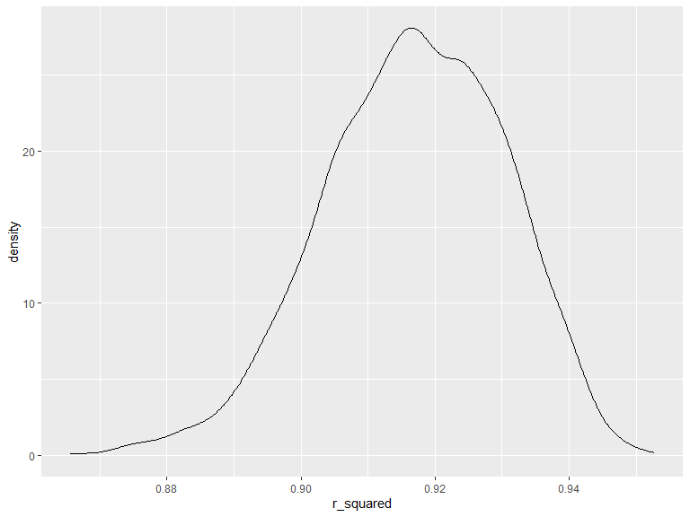

p8105_hw6_qra2000
================
Quinn Anderson
2023-11-30

## Problem 2

1.  Focus on a simple linear regression with tmax as the response with
    tmin and prcp as the predictors, and are interested in the
    distribution of two quantities estimated from these data:

r^2 log(β<sup>1∗β</sup>2)

2.  Use 5000 bootstrap samples and, for each bootstrap sample, produce
    estimates of these two quantities.

3.  Plot the distribution of your estimates, and describe these in
    words.

4.  Using the 5000 bootstrap estimates, identify the 2.5% and 97.5%
    quantiles to provide a 95% confidence interval for r^2 and
    log(β<sup>0∗β</sup>1)

Load and tidy the Central Park weather data from class:

``` r
weather_df = 
  rnoaa::meteo_pull_monitors(
    c("USW00094728"),
    var = c("PRCP", "TMIN", "TMAX"), 
    date_min = "2022-01-01",
    date_max = "2022-12-31") |>
  mutate(
    name = recode(id, USW00094728 = "CentralPark_NY"),
    tmin = tmin / 10,
    tmax = tmax / 10) |>
  select(name, id, everything())
```

    ## using cached file: C:\Users\Quinn\AppData\Local/R/cache/R/rnoaa/noaa_ghcnd/USW00094728.dly

    ## date created (size, mb): 2023-09-28 10:18:43.183258 (8.541)

    ## file min/max dates: 1869-01-01 / 2023-09-30

Now, fit linear regression to the data set.

``` r
weather_lm = weather_df |> lm(btw ~ tmax * tmin * prcp, data = weather_df)
```

## Problem 3

For this problem, we analyze data which consists of roughly 4000
children to understand the effects of several variables on a child’s
birthweight.

First, we load and clean the data for regression analysis and convert
the `babysex`, `frace`, and `mrace` variables to factor variables. We
also check for missing values.

``` r
bwt_df = read.csv("./data/birthweight.csv") |> 
  mutate(
    babysex = as.factor(case_when(babysex == 1 ~ "male",
                                  babysex == 2 ~ "female")),
    frace = as.factor(case_when(frace == 1 ~ "White",
                                frace == 2 ~ "Black",
                                frace == 3 ~ "Asian",
                                frace == 4 ~ "Puerto Rican",
                                frace == 8 ~ "Other",
                                frace == 9 ~ "Unknown")),
    mrace = as.factor(case_when(mrace == 1 ~ "White",
                                mrace == 2 ~ "Black",
                                mrace == 3 ~ "Asian",
                                mrace == 4 ~ "Puerto Rican",
                                mrace == 8 ~ "Other")))

sapply(bwt_df, function(x) sum(is.na(x)))
```

    ##  babysex    bhead  blength      bwt    delwt  fincome    frace  gaweeks 
    ##        0        0        0        0        0        0        0        0 
    ##  malform menarche  mheight   momage    mrace   parity  pnumlbw  pnumsga 
    ##        0        0        0        0        0        0        0        0 
    ##    ppbmi     ppwt   smoken   wtgain 
    ##        0        0        0        0

Next, we propose a regression model based on a hypothesized structure
for the factors that underly birthweight. My variables of interest are:
family monthly income (in hundreds, rounded), average number of
cigarettes smoked per day during pregnancy, and mother’s weight gain
during pregnancy (pounds).

We fit the simple linear regression to the dataset, summarize model
estimates, and plot the model residuals against fitted values.

``` r
fit_1 = lm(bwt ~ fincome * smoken * wtgain, data = bwt_df)

fit_1 |> broom::tidy() |> knitr::kable(digits = 3)
```

| term                  | estimate | std.error | statistic | p.value |
|:----------------------|---------:|----------:|----------:|--------:|
| (Intercept)           | 2647.938 |    37.376 |    70.846 |   0.000 |
| fincome               |    5.402 |     0.764 |     7.069 |   0.000 |
| smoken                |   -5.100 |     4.720 |    -1.081 |   0.280 |
| wtgain                |   15.080 |     1.534 |     9.827 |   0.000 |
| fincome:smoken        |   -0.043 |     0.085 |    -0.508 |   0.611 |
| fincome:wtgain        |   -0.080 |     0.032 |    -2.502 |   0.012 |
| smoken:wtgain         |    0.115 |     0.186 |     0.616 |   0.538 |
| fincome:smoken:wtgain |   -0.002 |     0.003 |    -0.537 |   0.591 |

``` r
bwt_df |> 
  add_predictions(fit_1) |> 
  add_residuals(fit_1) |> 
  ggplot(aes(x = pred, y = resid)) + 
  geom_point()
```



The plot shows there is no linear relationship between the variables of
interest, so linearity is not a reasonable hypothesis. There are many
outliers.

Next, we compare this model to two others: one using length at birth and
gestational age as predictors, and one using head circumference, length,
sex, and all interactions (including the three-way interaction) between
these. We will make this comparison in terms of the cross-validated
prediction error.

``` r
cv_df =
  crossv_mc(bwt_df, 100) |> 
  mutate(
    train = map(train, as_tibble),
    test = map(test, as_tibble))

cv_df = 
  cv_df |> 
  mutate(
    fit_1 = map(train, \(df) lm(bwt ~ fincome * smoken * wtgain, data = df)),
    fit_2 = map(train, \(df) lm(bwt ~ blength + gaweeks, data = df)),
    fit_3 = map(train, \(df) lm(bwt ~ bhead * blength * babysex, data = df))) |> 
  mutate(
    rmse_fit_1 = map2_dbl(fit_1, test, \(mod, df) rmse(model = mod, data = df)),
    rmse_fit_2 = map2_dbl(fit_2, test, \(mod, df) rmse(model = mod, data = df)),
    rmse_fit_3 = map2_dbl(fit_3, test, \(mod, df) rmse(model = mod, data = df)))
```

Next, we will display the RMSE results.

``` r
cv_df |> 
  summarize(
    fit_1_mean_error = mean(rmse_fit_1),
    fit_2_mean_error = mean(rmse_fit_2),
    fit_3_mean_error = mean(rmse_fit_3)
  ) |> 
  knitr::kable(digits = 3)
```

| fit_1_mean_error | fit_2_mean_error | fit_3_mean_error |
|-----------------:|-----------------:|-----------------:|
|          488.265 |          332.229 |          288.603 |

The plot below shows the RMSE results in a violin plot:

``` r
cv_df |> 
  select(starts_with("rmse")) |> 
  pivot_longer(
    everything(),
    names_to = "model",
    values_to = "rmse",
    names_prefix = "rmse ") |> 
  mutate(model = fct_inorder(model)) |> 
  ggplot(aes(x = model, y = rmse)) + 
  geom_violin()
```


